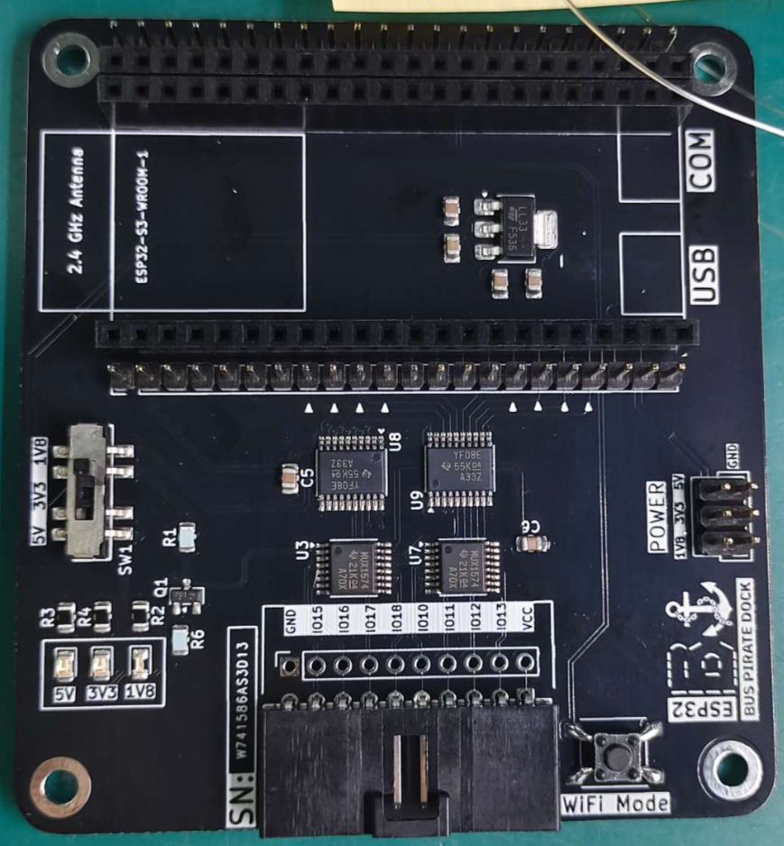
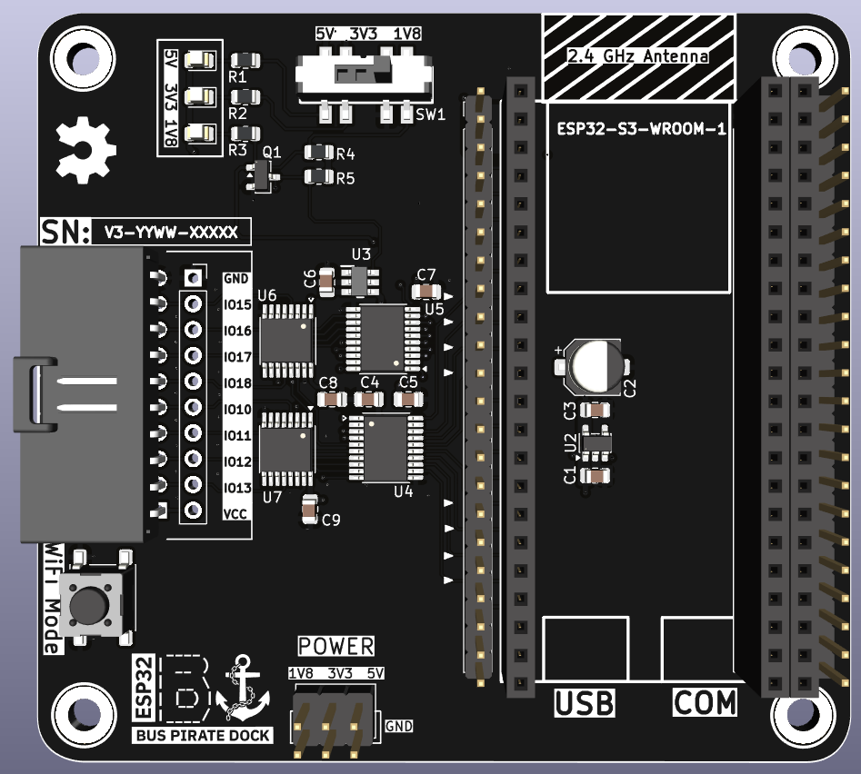
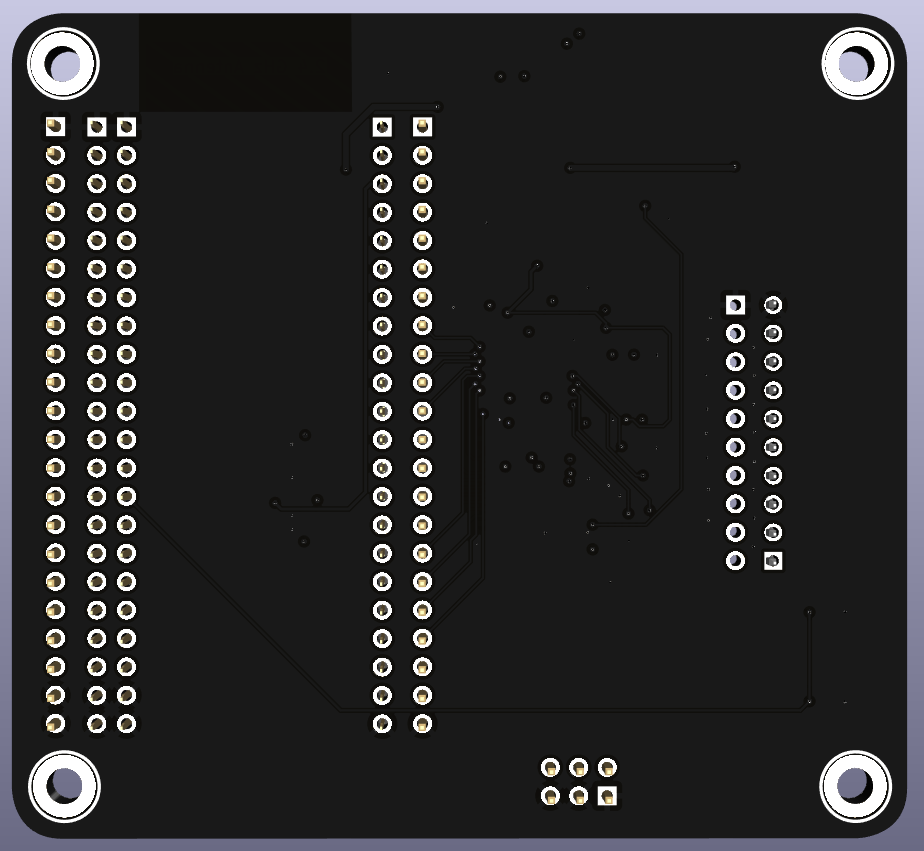

# ESP32-Bus-Pirate-Dock

Carrier board for the ESP32-S3 Devkit. Complements the [ESP32-Bus-Pirate](https://github.com/geo-tp/ESP32-Bus-Pirate) project.

## Overview

This project provides a dock for the Espressif ESP32-S3 Devkit, enabling 1.8V, 3.3V and 5V translation between the 3.3V ESP32-S3 and peripherals.

Fits original Devkits and AliExpress clones.

## PCB Design

### Top View

## Current Prototype

### Front Rendering

### Back Rendering

## License

See [LICENSE](LICENSE) for details.
