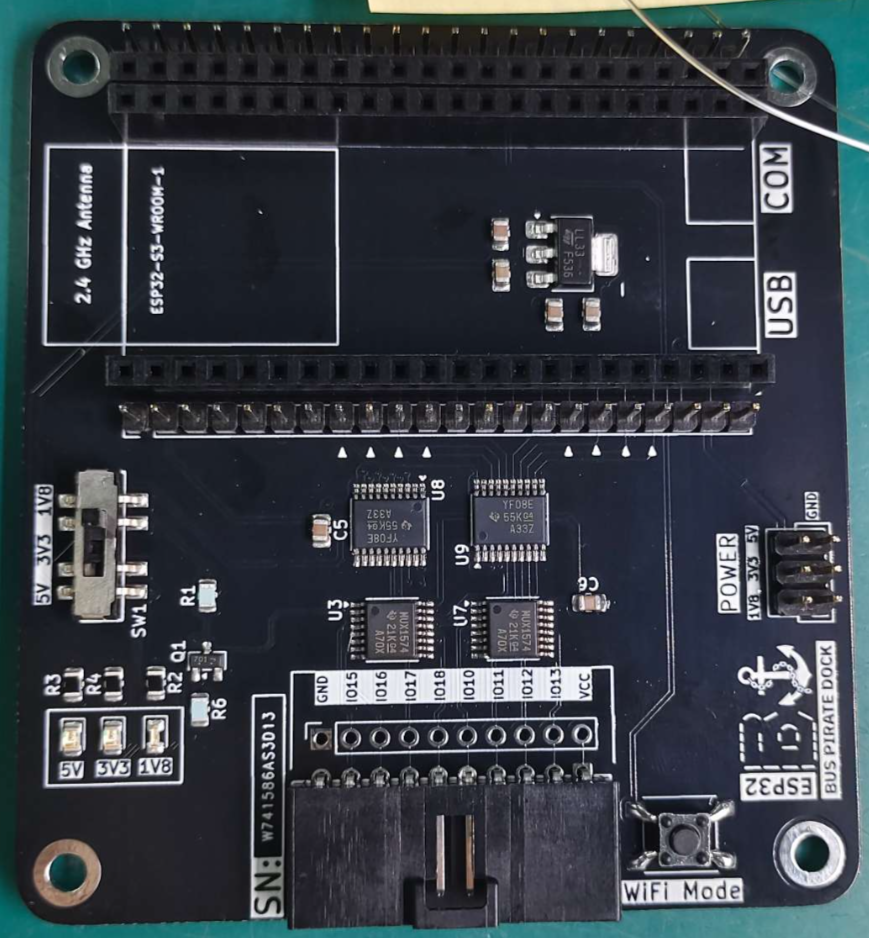
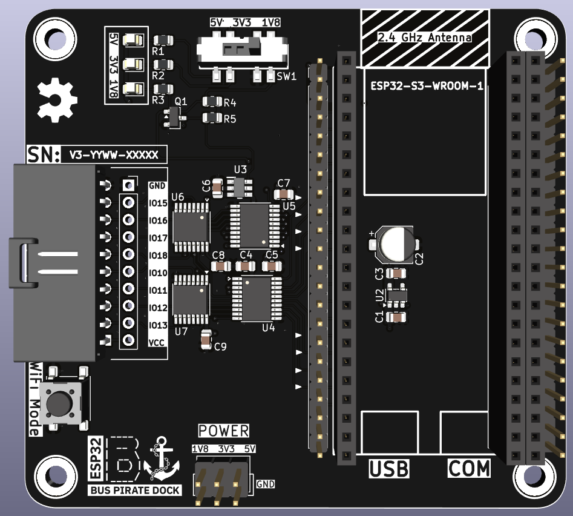
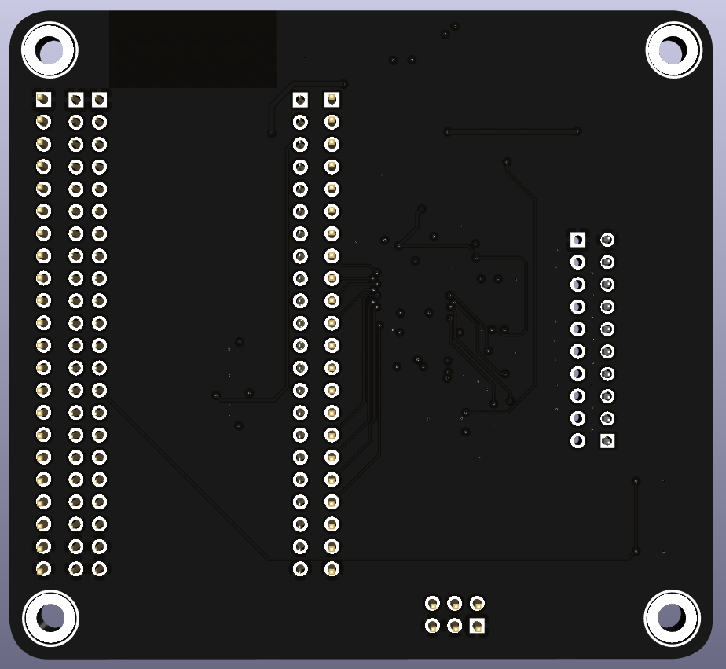

# ESP32-Bus-Pirate-Dock

Open-source carrier board for the Espressif ESP32-S3 DevKit, designed to complement the [ESP32-Bus-Pirate](https://github.com/geo-tp/ESP32-Bus-Pirate) project.

## Overview

ESP32-Bus-Pirate-Dock is a hardware dock/carrier board for the ESP32-S3 DevKit. It provides level and voltage translation between the 3.3V ESP32-S3 and external peripherals, with support for 1.8V, 3.3V, and 5V operation.

The design is intended to work with original ESP32-S3-DevKitC-1, as well as the wider devkit clones from third party suppliers.

## Hardware status

Current hardware revision: V3

## Repository contents

- `dock/kicad/` — KiCad design files
- `dock/gerbers/` — PCB fabrication outputs
- `dock/schematic.pdf` — exported schematic reference
- `dock/BOM.csv` — bill of materials
- `images/` — presentation images

## Open-source scope

This repository open-sources the dock hardware design, including:
- schematic and PCB layout source files
- fabrication outputs
- bill of materials
- project documentation and images included in this repository

## Required external parts

This project requires an **ESP32-S3 DevKit to be procured separately by the end user**.

The ESP32-S3 DevKit is a third-party board/module and is **not included** as part of this hardware design repository unless explicitly stated. Vendor silicon, datasheets, trademarks, and separately licensed third-party materials remain the property of their respective owners.

These boards can be acquired through the official Espressif manufacturer and it's stores, or through other third-party websites. If not buying a genuine one,
make sure the dimensions fit one of the header pins on the board.

## PCB Design

### Top View

## Current Prototype

### Front Rendering

### Back Rendering

## Manufacturing and assembly

To fabricate the PCB, use the files in `dock/gerbers/`.

To inspect or modify the design, use the original KiCad source files in `dock/kicad/`.

To source components, use `dock/BOM.csv`.

## License

Hardware design files in this repository are licensed under the CERN-OHL-W-2.0 license.

See [LICENSE](LICENSE) for the full license text.